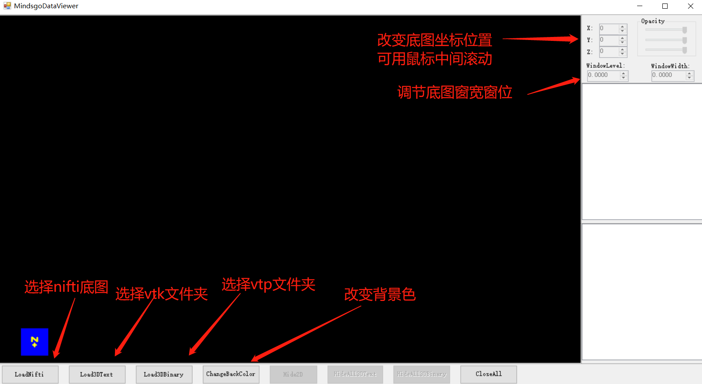

# BIDS-dMRIrecon

`BIDS-dmrirecon` 是针对人脑磁共振diffusion MRI弥散像的后处理流程，基于[MRtrix3](https://www.mrtrix.org/)开发。主要功能包括：
- 约束球面反卷积建模，不支持DSI采样 (*dwi2fod*)
- DTI定量参数计算 (*dwi2tensor*)
- 纤维追踪与定量 (*https://github.com/MIC-DKFZ/TractSeg*)
- DKI定量参数计算 (*https://github.com/m-ama/PyDesigner*)
- NODDI定量参数计算 (*https://github.com/daducci/AMICO*)
- ALPS定量参数计算 (*https://github.com/gbarisano/alps*)
- 脑结构网络生成 (*tck2connectome*)
- 可视化 (*vtk/vtp files*)

数据需要符合[Brain Imaging Data Structure](http://bids.neuroimaging.io/) (BIDS)格式。

[图谱说明](https://github.com/chenfei-ye/BIDS-fMRIpost/blob/main/resources/atlases.md)

[版本历史](CHANGELOG.md)

## 本页内容
* [数据准备](#数据准备)
* [安装](#安装)
* [运行前准备](#运行前准备)
* [运行](#运行)
* [参数说明](#参数说明)
* [输出结果](#输出结果)

## 数据准备
数据需要符合[Brain Imaging Data Structure](http://bids.neuroimaging.io/) (BIDS)格式。对于`DICOM`数据文件，建议使用[dcm2bids](https://unfmontreal.github.io/Dcm2Bids)工具进行转档，参考[dcm2bids 转档中文简易使用说明](dcm2bids.md)


## 安装
本地需安装[docker](https://docs.docker.com/engine/install)，具体可参考[步骤](docker_install.md)

### 方式一：拉取镜像
```
docker pull mindsgo-sz-docker.pkg.coding.net/neuroimage_analysis/base/bids-dmrirecon:latest
docker tag  mindsgo-sz-docker.pkg.coding.net/neuroimage_analysis/base/bids-dmrirecon:latest  bids-dmrirecon:latest
```

### 方式二：镜像创建
```
# git clone下载代码仓库
cd BIDS-dmrirecon
docker build -t bids-dmrirecon:latest .
```

## 运行前准备
使用[sMRIPrep](https://github.com/chenfei-ye/BIDS-sMRIprep) 完成T1影像的预处理
```
docker run -it --rm -v <bids_root>:/bids_dataset bids-smriprep:latest python /run.py /bids_dataset --participant_label 01 02 03 -MNInormalization -fsl_5ttgen -cleanup
```

使用[dMRIPrep](https://github.com/chenfei-ye/BIDS-dMRIprep) 完成dMRI影像的预处理
```
docker run -it --rm --gpus all -v <bids_root>:/bids_dataset bids-dmriprep:latest python /run.py /bids_dataset /bids_dataset/derivatives/dmri_prep participant --participant_label 01 02 03 -mode complete
```

## 运行

### 默认运行
```
docker run -it --rm -v <bids_root>:/bids_dataset bids-dmrirecon:latest python /run.py /bids_dataset /bids_dataset/derivatives/dmri_recon participant --participant_label 01 02 03 -mode tract,dti_para,connectome -bundle_json /scripts/bundle_list_all72.json -wholebrain_fiber 5000000 -atlases AAL3_MNI desikan_T1w -cleanup
```

### 可选运行: 将所有被试计算完成的定量参数汇总成表格
```
docker run -it --rm -v <bids_root>:/bids_dataset bids-dmrirecon:latest python /scripts/json2csv.py /bids_dataset participant
```

## 运行模式说明：
-  `-mode`：对应不同的分析模式，支持多模式同时跑，用逗号间隔。默认为`tract`。

-  `-mode tract`：对应白质纤维束自动分割
-  `-mode dti_para`：对应生成DTI参数
-  `-mode alps`：对应生成TDI参数
-  `-mode dki_para`：对应生成DKI参数
-  `-mode noddi_para`：对应生成NODDI参数
-  `-mode connectome`：对应生成脑结构网络

## 参数说明
####   固定参数说明：
-   `/bids_dataset`: 容器内输入BIDS路径，通过本地路径挂载（-v）
-   `/bids_dataset/derivatives/dmri_prep`: 输出路径
-   `participant`: 个体被试水平的顺序执行

####   可选参数说明：
-   `--participant_label [str]`：指定分析某个或某几个被试。比如`--participant_label 01 03 05`。否则默认按顺序分析所有被试。
-   `--session_label [str]`：指定分析同一个被试对应的某个或某几个session。比如`--session_label 01 03 05`。否则默认按顺序分析所有session。
-  `-tracking [prob|det]`：纤维追踪模式，prob对应概率性，det对应确定性。默认选择概率性
-  `-odf [tom|peaks]`：弥散建模的方向密度函数，tom对应单向参数图，peaks对应多向参数图。默认选择单向参数
-   `-no_endmask_filtering`：禁用`endings_mask`过滤streamline的生成模式。默认False
-  `-wholebrain_fiber_num [int]`：全脑纤维追踪的streamline数量，默认10000000
-  `-fiber_num [int]`：每个纤维束的streamline数量，默认2000
-  `-bundle_json [str]`：需要追踪的纤维束名字的json文件（完整纤维束路径`/scripts/bundle_list_all72.json`）。如果该参数缺失，则只跑CC、CST_left、CST_right三个纤维束作为测试
-   `-atlases [str]`: 指定分析某个或某几个图谱。如`-atlases AAL3_MNI hcpmmp_T1w`。对于后缀为`T1w`的图谱，需要预先对被试进行FreeSurfer分割。目前预定义的图谱见`atlas_config_docker.json`。
-   `-resume`: 在上一次tmp文件夹保存的进度基础上继续跑pipeline（debug时，每次重复跑pipeline，会把每次的中间结果存储在工作目录下以tmp字符开头的文件夹，后面跟随机字符串，比如tmp-O6LSA0）
-   `-cleanup`: 删除临时目录
-   `-no_vtp`：禁用可视化文件生成功能

#### 关于odf参数、no_endmask_filtering参数和tracking参数的额外说明(场景2作为默认)：

-   场景1：no_endmask_filtering == True，则无视odf参数和tracking参数的取值，调用MRtrix的tckgen FACT实现确定性追踪纤维，追踪的种子点在对应纤维束的bundle mask上随机采样;
-   场景2：tracking == 'prob' ， odf == 'tom' 对应TractSeg的概率性纤维追踪算法，不需要用到tckgen，概率追踪，速度快
-   场景3：tracking == 'fact'， odf == 'tom' 对应tckgen FACT，即FACT确定性纤维追踪法，基于单向参数图，不设置种子点，速度快
-   场景4：tracking == 'fact' ，odf == 'peaks' 对应tckgen FACT，即FACT确定性纤维追踪法，基于多向参数图，设置1百万种子点，速度较慢
-   场景5：tracking == 'sd_stream' ，odf == 'peaks' 对应tckgen SD_STREAM，即SD_STREAM确定性纤维追踪法，基于多向参数图，设置1百万种子点，速度较慢

## 输出结果
-   `DTI_mapping`：包含DTI的参数图，即`FA`/`MD`/`RD`/`AD`/`DEC-map`，以及在bundle mask上/纤维束tck上/脑区上的纤维束DTI参数统计信息json。其中`DEC-map`表示directionally-encoded colour map。
-   `fiber_tracts`：包含2个文件夹：`fiber_tracts/bundle_segmentations`包含每个纤维束的bundle mask；`fiber_tracts/Fibers`包含纤维束tck文件 。`fiber_streamline.json`是每个纤维束的统计信息。
-   `TDI_mapping`：包含TDI参数图，和在bundle mask上的纤维束TDI参数统计信息json
-   `DKI_mapping`：包含DKI参数图，即MK/RK/AK/KA，和在bundle mask上/脑区上的纤维束DKI参数统计信息json
-   `NODDI_mapping`：包含NODDI参数图，即`FIT_ICVF.nii.gz`/`FIT_OD.nii.gz`/`FIT_ISOVF.nii.gz`/`FIT_dir.nii.gz`（分别代表ICVF参数图、ODI参数图、ISOVF参数图、NODDI方向彩图。注意方向彩图是4维，和DTI的dec方向图类似），和在bundle mask上/脑区上的纤维束NODDI参数统计信息json
-   `connectome`: 包含Lookuptable和每一个脑图谱对应的结构连接网络。对于每一个脑图谱，`*_connectome.csv`表示脑连接定义为纤维束数量；`*_meanlength.csv`表示脑连接定义为纤维束平均长度；`*_invnodevol.csv`表示脑连接定义为纤维束数量+脑区体积矫正；`*_dwispace.nii.gz`是DWI空间的Label图。
-   `visualization`：可视化文件。其中`Fibers_vtp`包括每个纤维束；`Fibers_bundlemask_vtp`包括每个纤维束的整体mask；`Fibers_endingmask_vtp`包括每个纤维束两端mask。


##   可视化说明（主要用于本地qc和实验室画图）

在本地win系统下载并安装[MindsGoDataViewer](http://api.open.brainlabel.org/data/ycf/MindsGoDataViewer_Setup_V1.0_Release_20210730%2010-46-13.exe)，打开软件可针对`/derivatives/dmri_recon/visualization`文件夹的内容进行可视化。


先选择本地nifti底图文件，再选择本地vtk文件夹，再选择本地vtp文件夹。


对于同一数据格式（如vtp）的图像需放置在同一个文件夹。


对于tractseg算法，流程上先基于图谱的训练模型，对具体纤维束（如上图中的CST bundle_mask）进行自动分割；然后基于bundle_mask自动估计出顶端（endings_e）和底端（endings_b）；最后根据Tract Orientation Maps (TOMs)进行纤维追踪，默认限制条件是纤维空间在bundle_mask内部，且每一根streamline同时连接顶端（endings_e）和底端（endings_b），直到满足条件的纤维个数达到阈值（默认2000）。

## Copyright
Copyright © chenfei.ye@foxmail.com
Please make sure that your usage of this code is in compliance with the code license.


